# Database Schema Diagram

## Entity Relationship Diagram

```mermaid
erDiagram
    %% Authentication & Users
    profiles {
        uuid id PK
        uuid user_id FK
        text email
        text full_name
        text department
        text status
        text avatar_url
    }
    
    user_roles {
        uuid id PK
        uuid user_id FK
        app_role role
    }
    
    %% CRM Module
    leads {
        uuid id PK
        text name
        text email
        text company
        text phone
        text status
        text source
        int score
        uuid assigned_to FK
        uuid created_by FK
    }
    
    business_partners {
        uuid id PK
        text card_code
        text card_name
        text card_type
        text email
        text phone
        numeric balance
        numeric credit_limit
        uuid assigned_to FK
        text sap_doc_entry
        sync_status sync_status
    }
    
    opportunities {
        uuid id PK
        text name
        text company
        text stage
        numeric value
        int probability
        date expected_close
        uuid owner_id FK
        uuid business_partner_id FK
    }
    
    activities {
        uuid id PK
        text type
        text subject
        text description
        text status
        timestamp due_date
        uuid lead_id FK
        uuid opportunity_id FK
        uuid business_partner_id FK
        uuid assigned_to FK
    }
    
    %% Sales Module
    sales_orders {
        uuid id PK
        int doc_num
        date doc_date
        text customer_code
        text customer_name
        uuid customer_id FK
        numeric total
        text status
        text sap_doc_entry
    }
    
    sales_order_lines {
        uuid id PK
        uuid order_id FK
        int line_num
        text item_code
        text description
        numeric quantity
        numeric unit_price
        numeric line_total
    }
    
    ar_invoices {
        uuid id PK
        int doc_num
        date doc_date
        text customer_code
        text customer_name
        numeric total
        numeric paid_amount
        numeric balance_due
        text status
    }
    
    ar_invoice_lines {
        uuid id PK
        uuid invoice_id FK
        int line_num
        text item_code
        numeric quantity
        numeric unit_price
    }
    
    incoming_payments {
        uuid id PK
        int doc_num
        date doc_date
        text customer_code
        numeric total_amount
        text payment_type
        text status
    }
    
    items {
        uuid id PK
        text item_code
        text description
        text item_type
        text item_group
        numeric default_price
        int in_stock
        text warehouse
    }
    
    %% HR Module
    departments {
        uuid id PK
        text name
        text code
        text description
        uuid manager_id FK
        uuid parent_department_id FK
    }
    
    positions {
        uuid id PK
        text title
        text code
        uuid department_id FK
        numeric min_salary
        numeric max_salary
        bool is_active
    }
    
    employees {
        uuid id PK
        text employee_code
        text first_name
        text last_name
        text email
        text phone
        date hire_date
        uuid department_id FK
        uuid position_id FK
        uuid manager_id FK
        uuid user_id FK
        numeric basic_salary
        text employment_status
    }
    
    hr_managers {
        uuid id PK
        uuid employee_id FK
        bool is_active
    }
    
    leave_types {
        uuid id PK
        text name
        text code
        int default_days_per_year
        bool is_paid
        bool is_active
    }
    
    leave_balances {
        uuid id PK
        uuid employee_id FK
        uuid leave_type_id FK
        int year
        numeric entitled_days
        numeric used_days
        numeric pending_days
    }
    
    leave_requests {
        uuid id PK
        uuid employee_id FK
        uuid leave_type_id FK
        date start_date
        date end_date
        numeric total_days
        text status
        text approval_stage
        uuid direct_manager_id FK
        uuid dept_manager_id FK
        uuid hr_manager_id FK
    }
    
    attendance {
        uuid id PK
        uuid employee_id FK
        date attendance_date
        timestamp check_in_time
        timestamp check_out_time
        numeric work_hours
        text status
        numeric check_in_latitude
        numeric check_in_longitude
    }
    
    payroll_periods {
        uuid id PK
        text name
        date start_date
        date end_date
        date pay_date
        text status
        numeric total_gross
        numeric total_net
    }
    
    payslips {
        uuid id PK
        uuid employee_id FK
        uuid payroll_period_id FK
        numeric basic_salary
        numeric housing_allowance
        numeric transport_allowance
        numeric gross_salary
        numeric total_deductions
        numeric net_salary
        text status
    }
    
    performance_cycles {
        uuid id PK
        text name
        int year
        date start_date
        date end_date
        text status
    }
    
    performance_goals {
        uuid id PK
        uuid employee_id FK
        uuid cycle_id FK
        text title
        text category
        numeric weight
        numeric target_value
        numeric actual_value
        text status
    }
    
    performance_reviews {
        uuid id PK
        uuid employee_id FK
        uuid cycle_id FK
        uuid reviewer_id FK
        numeric overall_rating
        text status
        text achievements
        text strengths
    }
    
    %% Material Requests
    material_requests {
        uuid id PK
        text mr_number
        date request_date
        text project_name
        text department
        text status
        uuid requested_by_id FK
        uuid reviewed_by_id FK
        uuid approved_by_1_id FK
        uuid approved_by_2_id FK
        uuid approved_by_3_id FK
    }
    
    material_request_lines {
        uuid id PK
        uuid material_request_id FK
        int line_num
        text part_no
        text description
        numeric quantity
        text unit_of_measurement
    }
    
    mr_workflow_settings {
        uuid id PK
        int approval_level
        text position_title
        text department
        app_role role_required
        bool is_active
    }
    
    mr_approvers {
        uuid id PK
        int approval_level
        uuid user_id FK
        text user_name
        text user_email
        bool is_active
    }
    
    %% Relationships
    profiles ||--o{ user_roles : has
    
    leads ||--o{ activities : has
    business_partners ||--o{ activities : has
    business_partners ||--o{ opportunities : has
    business_partners ||--o{ sales_orders : has
    business_partners ||--o{ ar_invoices : has
    opportunities ||--o{ activities : has
    
    sales_orders ||--|{ sales_order_lines : contains
    ar_invoices ||--|{ ar_invoice_lines : contains
    
    departments ||--o{ positions : has
    departments ||--o{ employees : has
    departments ||--o| departments : parent
    positions ||--o{ employees : has
    employees ||--o{ employees : manages
    employees ||--o| hr_managers : is
    
    employees ||--o{ leave_balances : has
    employees ||--o{ leave_requests : submits
    leave_types ||--o{ leave_balances : type
    leave_types ||--o{ leave_requests : type
    
    employees ||--o{ attendance : records
    employees ||--o{ payslips : receives
    payroll_periods ||--|{ payslips : contains
    
    employees ||--o{ performance_goals : has
    employees ||--o{ performance_reviews : receives
    performance_cycles ||--o{ performance_goals : period
    performance_cycles ||--o{ performance_reviews : period
    
    material_requests ||--|{ material_request_lines : contains
```



## Table Relationships Summary

### User & Auth
- `profiles` → One-to-one with Supabase `auth.users`
- `user_roles` → Many-to-one with profiles (users can have multiple roles)

### CRM Flow
```
Leads → Opportunities → Sales Orders → AR Invoices → Incoming Payments
         ↓
    Business Partners (converted leads)
```

### HR Hierarchy
```
Departments → Positions → Employees
     ↓            ↓
  Manager     HR Managers
```

### Approval Workflows

**Leave Requests:**
```
Employee → Direct Manager → Dept Manager → HR Manager
```

**Material Requests:**
```
Requester → Reviewer → Approver L1 → Approver L2 → Approver L3
```

## Key Enums

### `app_role`
- `admin`
- `manager`
- `sales_rep`
- `user`

### `sync_status`
- `pending`
- `synced`
- `error`
- `conflict`

## Indexes

Important indexes for query performance:
- `business_partners.card_code` - Unique
- `employees.employee_code` - Unique
- `items.item_code` - Unique
- `sales_orders.doc_num` - Unique sequence
- `ar_invoices.doc_num` - Unique sequence
- `material_requests.mr_number` - Unique

## Security Model

All tables have RLS enabled with policies based on:
1. **Ownership** - Users can access their own data
2. **Assignment** - Users can access data assigned to them
3. **Role-based** - Admins/Managers have broader access
4. **Hierarchy** - Department managers see their team's data

